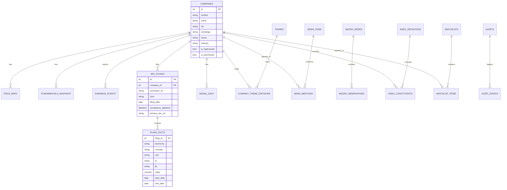
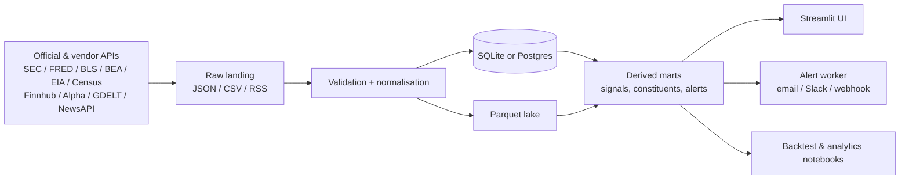
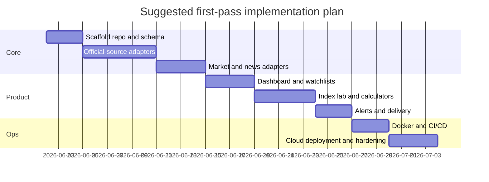

# Build Plan for an AI Infrastructure Watcher Index in Streamlit

## Executive summary

The highest-confidence architecture for an **AI Infrastructure Watcher/Index** is a **hybrid ingestion and serving stack**: use **official/primary sources** wherever possible for filings and macro data, then add **one vendor market-data API** and **one broad news API** to fill the gaps that official sources do not cover. For a first production-capable build, the source stack I would prioritise is **SEC EDGAR + FRED + BLS + BEA + EIA + Census** for primary data, **Finnhub** for quote/profile/earnings convenience, **Alpha Vantage** as a useful fallback for earnings/news sentiment, and **GDELT** or **NewsAPI** for broad English-language headline coverage. The reason is simple: SEC and government APIs are free, stable, and authoritative for filings and macro, while vendor APIs are still necessary for market prices and convenient earnings/news workflows. citeturn14view0turn5view1turn16view0turn17view0turn21view0turn24view0turn25view2turn10search0turn42search0turn46view0turn47view0

For the app itself, I would **not** make Streamlit responsible for all background jobs. Streamlit is excellent for a fast front end, stateful widgets, caching, secrets handling, fragments, and multipage apps, but the ingestion/alert engine should live in a separate worker or scheduled CLI. In practice, that means **Streamlit for read/query/UI**, and **a separate Python package + scheduler** for fetching, normalising, computing signals, and sending alerts. Streamlit’s own docs support this split: `st.cache_data` is for serialisable data, `st.cache_resource` is for shared resources such as DB connections, `st.session_state` is for per-session state, `st.navigation` is the preferred multipage mechanism, and `st.secrets` is the native secrets path. citeturn38search0turn38search11turn38search1turn38search14turn38search6turn38search16

The best starting storage choice is **SQLite + Parquet** for local development and an early single-user deployment, with a clear upgrade path to **Postgres + Parquet** once you want multi-user access, more concurrent writes, or hosted deployment. The guiding rule is: **Parquet for immutable/raw and analytical snapshots; relational DB for serving UI queries, joins, alerts, and metadata**. This keeps the design simple enough for Codex to generate in phases and lets you defer cloud complexity until the app proves useful.

A realistic first implementation is **around 45–65 hours** if you keep scope disciplined: one curated index, 20–60 tracked names, five to eight signal families, and three alert channels. The fastest route to a genuinely useful first release is: **prices + filings + curated watchlists + one index editor + one news feed + one earnings calendar + alerts**. Everything else is an enhancement.

## Recommended source stack and free API options

Your data needs divide naturally into six buckets: **prices**, **fundamentals**, **earnings**, **news**, **filings**, and **macro/hyperscaler-capex signals**. The table below is the most practical stack for a Streamlit watcher that must remain low-cost while staying anchored to primary sources.

| Need | Recommended source | Example endpoint family or query | Auth | Published free-tier / limit | Best use in this app | Fallback | Source |
|---|---|---|---|---|---|---|---|
| Filings ledger | SEC EDGAR Submissions API | `https://data.sec.gov/submissions/CIK##########.json` | None, but set declared `User-Agent` | SEC fair-access guidance: **10 requests/sec** max | Detect new 10-Q, 10-K, 8-K, 6-K, 20-F, 40-F; filing timestamps; ticker/exchange metadata | EDGAR RSS, daily/full indexes | citeturn14view0turn5view1turn13view3turn35search1 |
| Filing facts / capex facts | SEC XBRL APIs | `.../api/xbrl/companyfacts/CIK##########.json`, `.../companyconcept/...`, `.../frames/...` | None | Same SEC fair-access guidance | Extract capex, PP&E additions, revenue, segment facts, hyperscaler capex history | Bulk `companyfacts.zip` nightly archive | citeturn14view0turn5view1 |
| Ticker to CIK mapping | SEC ticker files | `company_tickers.json`, `company_tickers_exchange.json` | None | No numeric cap published on file pages; still respect SEC fair access | Canonical security master and join key creation | Manual mapping table in DB | citeturn35search1turn35search2 |
| Macro time series | FRED | `fred/series/observations`, `fred/releases`, `fred/series/search`, `fred/series/vintagedates` | API key required | Current terms require a key; numeric hard cap is not surfaced in the main docs/terms reviewed | Rates, inflation, industrial production, electricity prices, credit conditions, release dates | Direct BLS/BEA/EIA/Census endpoints | citeturn15view0turn16view0 |
| Labour and inflation micro series | BLS Public Data API v2 | timeseries endpoint for one or more series | Registration key required for v2 | Registered v2: **500 queries/day**, **50 series/query**, **20 years/query**, **50 req/10 sec**; annual renewal required | CPI/PPI, employment, wages, sector inflation | FRED mirror where acceptable | citeturn17view0 |
| National/regional macro and fixed assets | BEA API | `https://apps.bea.gov/api/data?method=...` with `GetDataSetList`, `GetParameterList`, `GetParameterValues`, `GetData` | 36-character `UserID` | Current user guide reviewed does not expose a simple numeric rate cap | GDP, fixed assets, regional income, industry data | FRED for broad aggregates | citeturn21view0turn22view1turn5view9 |
| Grid, power and energy markets | EIA API v2 | `https://api.eia.gov/v2/...`; examples include electricity retail sales and `seriesid` bridge | API key | EIA does not publish full firewall rules, but says staying under roughly **5 req/sec** burst and **~9,000/hour** sustained avoids throttling under ideal conditions; **5,000 rows** max per response | Hourly grid demand, generation by fuel, electricity prices, balancing authority data | EIA browser/export and FRED series | citeturn24view0turn23view1turn26search0turn26search2 |
| Demographics and geography | Census API | `https://api.census.gov/data/{year}/{dataset}?...` | Census key | Current guidance says **all data queries now require an API key**; docs also retain **50 vars/query** and **500 queries/IP/day** guidance | State/county context, population, construction, household growth | BEA regional data | citeturn25view2turn25view1 |
| Quotes and simple market data | Finnhub | `/quote`, `/stock/candle`, `/stock/profile2`, `/stock/metric`, `/calendar/earnings`, `/company-news` | API key | Pricing page snippet: **60 API calls/minute** general, **900/min** market data, **300/min** fundamentals; docs also note a **30 calls/sec** ceiling | Primary vendor for prices, profiles, earnings calendar convenience | Twelve Data, Alpha Vantage, Tiingo | citeturn10search0turn0search7turn29search0turn29search3turn30search0turn30search1turn30search4 |
| Fallback prices and earnings | Alpha Vantage | `TIME_SERIES_DAILY`, `GLOBAL_QUOTE`, `OVERVIEW`, `EARNINGS`, `EARNINGS_CALENDAR`, `NEWS_SENTIMENT` | API key | Support page currently states free service for **up to 25 requests/day**; premium page starts at **75 req/min** and removes daily caps | Fallback daily prices, earnings history/calendar, news sentiment | Finnhub or Twelve Data | citeturn28view0turn28view1turn27view0turn27view1turn27view2turn27view3turn6view0turn42search0 |
| Alternative price API | Twelve Data | `/time_series`, `/earnings_calendar`, `/profile`, `/income_statement/...` | API key | Free plan: **8 API credits/min** and **800/day**; credit cost depends on endpoint | Strong fallback for price history and some fundamentals | Finnhub, Tiingo | citeturn11search0turn32search0turn43search0turn44search0 |
| EOD and news fallback | Tiingo | EOD endpoint, news endpoint, fundamentals endpoint | API key | Docs state account-level hourly/daily limits; search result shows usage-limit section and free usage constraints; fundamentals are an add-on with limited free evaluation | Clean EOD fallback and ticker-linked news | Twelve Data, Alpha Vantage | citeturn12search0turn45search0turn45search1turn45search2 |
| Broad English-language news | NewsAPI | `/v2/everything`, `/v2/top-headlines`, `/v2/top-headlines/sources` | API key | Developer plan: **100 requests/day**, **24-hour article delay**, development/testing only | Broad headline aggregation for the news pane and alerts | GDELT DOC, vendor news endpoints | citeturn37search1turn37search0turn47view0 |
| Open broad news search | GDELT DOC API | `https://api.gdeltproject.org/api/v2/doc/doc?...` | No key | No simple numeric cap surfaced in the material reviewed; JSON APIs and RSS outputs available | Open global news search, timeline/tone views, RSS-like workflows | NewsAPI | citeturn5view7turn46view0 |

Two practical conclusions follow from those docs. First, **filings and macro data should be official-source first** because the free official APIs are good enough and give you auditability. Second, **market prices will still be vendor-led** because the reviewed official sources do not provide a comparable free consolidated equities API; the vendors explicitly handle licensing and quota constraints. That is an inference from the source set rather than a formal market rule. citeturn14view0turn16view0turn17view0turn24view0turn25view2turn10search0turn42search0

For **hyperscaler capex signals**, the best primary route is:

```text
SEC submissions -> detect new 10-Q / 10-K / 8-K
SEC companyfacts/companyconcept -> extract capex and PP&E tags
Investor relations release text / earnings press release URLs -> optional textual parsing
EIA grid data -> optional external confirmation of power-demand trends
```

That gives you a signal chain grounded in **official company disclosures first**, then enriched by market/news APIs second.

A good initial tracked universe for the app is three layers:

- **Demand creators**: NVDA plus hyperscalers such as MSFT, AMZN, GOOGL, META.
- **AI infra suppliers**: semicap, networking, memory, optics, cooling, backup power, engineering/construction, utilities.
- **Power and real-world bottleneck names**: utilities, electrical equipment, datacentre REITs, generators, grid components.

## Data model and storage

The fastest durable schema is a **serving-oriented relational core** plus **append-only raw files**. Keep relational tables narrow and queryable from Streamlit; keep raw payloads and wide analytics snapshots in Parquet/JSON for reproducibility.

**Recommended phase design**

- **Phase one**: SQLite for the application DB, Parquet for raw and derived snapshots.
- **Phase two**: Postgres for the application DB, Parquet retained for raw archives and heavier analytics exports.
- **Never skip** the raw landing area. It is your audit trail when vendor payloads change, fields disappear, or you need to replay ETL.

### Core schema

| Table | Key fields | Purpose |
|---|---|---|
| `companies` | `id`, `symbol`, `name`, `cik`, `exchange`, `sector`, `industry`, `country`, `is_hyperscaler`, `is_benchmark` | Canonical entity/security master |
| `themes` | `id`, `code`, `name`, `description`, `parent_theme_id` | AI infra theme taxonomy |
| `company_theme_exposure` | `company_id`, `theme_id`, `exposure_score`, `confidence`, `source`, `as_of_date` | Manual or modelled mapping of constituents to themes |
| `price_bars` | `company_id`, `date`, `open`, `high`, `low`, `close`, `adj_close`, `volume`, `provider`, `interval` | Daily or intraday market history |
| `fundamentals_snapshot` | `company_id`, `as_of_date`, `market_cap`, `ev`, `ttm_revenue`, `ttm_ebitda`, `ttm_eps`, `pe`, `ps`, `ev_sales`, `ev_ebitda`, `fcf_yield`, `provider` | Valuation and scale snapshot |
| `earnings_events` | `company_id`, `event_date`, `fiscal_period`, `eps_actual`, `eps_estimate`, `revenue_actual`, `revenue_estimate`, `surprise_pct`, `source` | Earnings calendar and realised results |
| `sec_filings` | `id`, `company_id`, `accession_no`, `form`, `filing_date`, `acceptance_datetime`, `primary_doc_url`, `filing_json_url`, `is_new` | Filing index for alerts and parsing |
| `filing_facts` | `filing_id`, `taxonomy`, `concept`, `unit`, `fy`, `fp`, `frame`, `value`, `start_date`, `end_date` | Normalised XBRL facts |
| `news_items` | `id`, `published_at`, `title`, `summary`, `url`, `source_name`, `provider`, `sentiment_score`, `relevance_score`, `lang` | Headline/news store |
| `news_mentions` | `news_id`, `company_id`, `ticker`, `is_primary_match` | Join table from news to companies |
| `macro_series` | `id`, `source`, `series_code`, `name`, `freq`, `unit`, `category` | Reference for macro series |
| `macro_observations` | `series_id`, `date`, `value`, `release_date`, `vintage_date` | Macro data observations |
| `index_definitions` | `id`, `name`, `base_date`, `base_value`, `method`, `rebalance_rule`, `max_single_name`, `liquidity_floor` | Index metadata |
| `index_constituents` | `index_id`, `company_id`, `effective_from`, `effective_to`, `target_weight`, `theme_weight`, `manual_override` | Historical membership and weights |
| `signal_daily` | `company_id`, `date`, `exposure_score`, `sentiment_7d`, `corr_nvda_60d`, `corr_hyperscalers_60d`, `earnings_sensitivity`, `power_signal`, `capex_signal`, `composite_score` | Daily precomputed UI/alert signal layer |
| `watchlists` | `id`, `name`, `description`, `is_system` | Saved baskets |
| `watchlist_items` | `watchlist_id`, `company_id`, `sort_order`, `note` | Saved membership |
| `alerts` | `id`, `name`, `rule_type`, `config_json`, `channel`, `is_enabled`, `last_triggered_at` | Alert definitions |
| `alert_events` | `alert_id`, `triggered_at`, `entity_type`, `entity_id`, `payload_json`, `delivery_status` | Alert history and dedupe |
| `job_runs` | `id`, `job_name`, `started_at`, `finished_at`, `status`, `rows_written`, `error_text` | Operational observability |

### ER diagram



### Storage choice

| Choice | Use it when | Strengths | Weaknesses | Recommendation |
|---|---|---|---|---|
| SQLite | Local dev, single user, small deployment | Zero ops, easy backups, simple for Codex to scaffold | Not ideal for concurrent write-heavy hosted usage | **Best phase-one serving DB** |
| Postgres | Hosted app, multiple users, background workers, more joins | Better concurrency, better scheduling/deploy story, easier long-term growth | Needs managed service or ops | **Best phase-two serving DB** |
| Parquet | Raw snapshots, replay, backtests, wide analytical exports | Cheap, compact, fast with Pandas/Polars | Not enough on its own for app state and alerts | **Always keep for raw + marts** |

My recommendation is a **hybrid**:

```text
/raw/*.json or .csv        immutable provider payloads
/lake/*.parquet           normalised wide snapshots and backtest exports
/app.db or Postgres       serving layer for UI, alerts, operational metadata
```

## Pipeline and backend design

The system should be built as a **small Python package with a CLI**, not as a monolithic `streamlit_app.py`. That keeps ingestion testable and lets you run the exact same code from local cron, GitHub Actions, Heroku release/worker processes, Cloud Run jobs, or App Runner adjunct services.

### Proposed package layout

```text
ai_infra_watcher/
  app/
    main.py
    pages/
  core/
    settings.py
    logging.py
    db.py
    models.py
  sources/
    sec.py
    fred.py
    bls.py
    bea.py
    eia.py
    census.py
    finnhub.py
    alpha_vantage.py
    gdelt.py
    newsapi.py
  pipelines/
    ingest_prices.py
    ingest_filings.py
    ingest_macro.py
    ingest_news.py
    compute_signals.py
    compute_index.py
  alerts/
    rules.py
    delivery_email.py
    delivery_slack.py
    delivery_webhook.py
  tests/
```

### Ingestion pattern

Use the same pattern for every source:

1. **Fetch** into raw landing.
2. **Validate** against a typed schema.
3. **Normalise** to your canonical tables.
4. **Upsert idempotently**.
5. **Compute derived signals**.
6. **Persist a `job_runs` record**.

The most important engineering decisions are:

- **Idempotent fetches** using a provider-specific natural key.  
  Examples: `(company_id, date, interval)` for bars; `(accession_no)` for SEC filings; `(series_id, date, vintage_date)` for macro observations.
- **Retryable clients** with exponential backoff and `429`-aware sleep.
- **Provider token buckets** so that SEC, Finnhub, Alpha, EIA and others each honour their own quotas. SEC’s 10 requests/second max and declared `User-Agent` requirement should be hard-coded in your HTTP client wrapper. citeturn5view1turn13view3
- **Schema evolution tolerance** with raw payload retention. Vendor payloads change; keep the originals.

### Refresh cadence

| Pipeline | Cadence | Why |
|---|---|---|
| `ingest_filings` | Every 10–15 minutes on weekdays | Filing/event detection is one of the app’s highest-value functions |
| `ingest_news` | Every 10–15 minutes | Useful for intraday watcher behaviour |
| `ingest_prices_intraday` | Every 5–15 minutes during market hours if your vendor plan allows; otherwise skip | Nice to have, but not essential on free tiers |
| `ingest_prices_daily` | Once nightly after market close | Core index recompute |
| `ingest_earnings_calendar` | Daily | Calendar does not need sub-hour cadence |
| `ingest_macro_release_calendar` | Daily | Official release schedules move slowly |
| `ingest_macro_observations` | Daily plus on release days | Avoid wasted calls |
| `compute_signals` | After prices/news/filings jobs | Keeps serving layer fresh |
| `compute_index` | After signals and price refresh | Rebuild index tables and charts |

### Caching approach

Streamlit gives you exactly the primitives you need on the UI side: `st.cache_data` for data-returning functions, `st.cache_resource` for shared resources like database connections, `st.session_state` for per-user state, and `st.fragment` for independently rerunning parts of the UI. Use them, but use them only for **query-serving and page responsiveness**, not as your canonical pipeline scheduler. citeturn38search0turn38search11turn38search1turn38search16

A practical pattern is:

```python
@st.cache_resource
def get_engine():
    ...

@st.cache_data(ttl=300)
def load_dashboard_snapshot(index_id: int):
    ...

@st.cache_data(ttl=900)
def load_top_news(symbols: tuple[str, ...]):
    ...
```

### Error handling and retries

Use one provider wrapper per source with the same interface:

```python
class SourceClient:
    def get_json(self, path: str, params: dict) -> dict: ...
```

Recommended retry rules:

- `429`, `500`, `502`, `503`, `504`: retry with exponential backoff.
- SEC: fixed rate limiter plus no more than 10 req/sec. citeturn5view1turn13view3
- EIA: respect approximate burst/sustained guidance and paginate past 5,000 rows. citeturn24view0
- Alpha Vantage: plan for strict free-tier scarcity. citeturn6view0turn42search0
- Vendor quotas: emit a **staleness flag** rather than failing the whole app.

### Architecture visual



## Streamlit UI and user flows

The right Streamlit structure is a **multipage app** using `st.navigation` or, if you want the lowest-friction start, a simple `pages/` directory. Streamlit’s docs describe `st.navigation` as the preferred, more customisable path. Keep the front end divided into pages that match decisions a user actually makes. citeturn38search14turn38search7

### Page map

- **Dashboard**  
  Index level, top movers, latest signals, capex scoreboard, upcoming earnings.
- **Watchlists**  
  User-defined baskets and system baskets such as semicap, optics, cooling, power, datacentre REITs, hyperscalers.
- **Index lab**  
  Weight editor, rule toggles, rebalance preview, contribution analysis.
- **Company detail**  
  Price chart, relative performance, valuation, SEC filings, news, earnings, theme exposure.
- **News and filings**  
  Combined feed with filters for symbol, form type, provider, relevance, sentiment.
- **Calendar and alerts**  
  Earnings calendar, release calendar, alert rules, delivery logs.
- **Admin / data health**  
  Job status, API quota usage, stale datasets, last refresh times.

### Component list

| Component | Streamlit building block | Notes |
|---|---|---|
| Watchlist selector | `st.sidebar.selectbox`, `st.pills`, `st.multiselect` | Cache underlying queries |
| Index weighting editor | `st.data_editor` | Make `target_weight` editable; lock total to 100% |
| Price and index charts | `st.plotly_chart` or Altair | Plotly is easiest for dense finance UI |
| KPI tiles | `st.metric` | Use for index level, capex signal, sentiment, next earnings |
| Valuation and comparison tables | `st.dataframe` / `st.data_editor` | Sortable and exportable |
| News feed | `st.container`, `st.expander`, optionally `st.fragment` | Refresh only this panel if needed |
| Earnings calendar | `st.dataframe` + date filters | Highlight 7-day window |
| Alerts | `st.form`, `st.toggle`, `st.text_input`, `st.selectbox` | Save rules to DB |
| Data health | `st.dataframe`, status badges | Essential in a data app |

### Mock layout

```text
┌─────────────────────────────────────────────────────────────────────────────┐
│ Sidebar                                                                    │
│ - Page nav                                                                 │
│ - Watchlist / index selector                                               │
│ - Date range                                                               │
│ - Theme filters                                                            │
│ - Refresh / last updated                                                   │
├─────────────────────────────────────────────────────────────────────────────┤
│ Top row                                                                    │
│ [Index level] [1D/1W return] [Capex signal] [Power signal] [Next earnings] │
├───────────────────────────────┬─────────────────────────────────────────────┤
│ Left main                     │ Right rail                                  │
│ Price / relative performance  │ Latest filings                              │
│ Index contribution chart      │ Latest news                                 │
│ Correlation to NVDA/hypers    │ Upcoming earnings                           │
├───────────────────────────────┴─────────────────────────────────────────────┤
│ Bottom tabs: Valuation | Comparison | Exposure | Alerts | Data health      │
└─────────────────────────────────────────────────────────────────────────────┘
```

### User flows

**Morning review**

1. Open **Dashboard**.
2. Select `AI Infra Core` index.
3. Scan KPI row for overnight capex or power moves.
4. Review top filings and news from the last 12–24 hours.
5. Jump into any company detail if an alert fired overnight.

**Rebalance the custom index**

1. Open **Index lab**.
2. Choose rule mode: equal weight / exposure score / market-cap blend.
3. Edit weights in `st.data_editor`.
4. See instant validation: total weight, max-name cap, theme concentration.
5. Save as a new index definition and compute backfilled history.

**Investigate an earnings-driven move**

1. Open **Calendar and alerts** or **Company detail**.
2. See realised vs estimated EPS/revenue and your stored hyperscaler surprise metrics.
3. Review SEC 8-K or earnings release references.
4. Compare 3-day abnormal return vs historical earnings sensitivity.

## Analytics, indicators and notifications

This app’s value will come from a **small number of interpretable signals**, not from throwing every indicator into the UI. I would start with five families.

### Index maths

A good default is a **fixed-weight total return-lite price index** with periodic rebalancing:

\[
I_t = I_0 \times \prod_{d=1}^{t} \left(1 + \sum_i w_{i,d-1} r_{i,d}\right)
\]

where:

- \( r_{i,d} = \frac{P_{i,d}}{P_{i,d-1}} - 1 \)
- \( w_{i,d-1} \) is prior-day target or drifted weight
- \( I_0 = 100 \)

For a user-editable watcher, support three weighting modes:

1. **Equal weight**
2. **Exposure score weight**
3. **Blended weight**  
   \[
   w_i \propto 0.5 \cdot z(\text{Exposure}_i)^+ + 0.3 \cdot z(\log(\text{MktCap}_i))^+ + 0.2 \cdot z(\text{Liquidity}_i)^+
   \]

with hard caps such as:

- max single name: `12%`
- min tradability floor: average dollar volume threshold
- hyperscaler cap bucket: optional separate exposure cap

### Exposure score

Keep this transparent. Score each company across a small theme taxonomy, then aggregate.

\[
\text{ExposureScore}_i = \sum_t \alpha_t \cdot x_{i,t}
\]

Where:

- \(t\) might be `semicap`, `networking`, `optics`, `cooling`, `backup_power`, `utility_power`, `datacentre_reit`, `construction`
- \(x_{i,t}\) is a 0–5 analyst/model score
- \(\alpha_t\) is the current theme importance weight

This is intentionally editable. The UI should let you override the score manually.

### Earnings sensitivity

Measure how much a name tends to move when **NVDA or hyperscalers** report.

A usable signal is the historical average abnormal return around those events:

\[
\text{EarningsSensitivity}_i =
\frac{1}{N}\sum_{e=1}^{N}
\left(
AR_{i,e}^{[-1,+3]} \times \operatorname{sign}(S_e)
\right)
\]

Where:

- \(AR_{i,e}^{[-1,+3]}\) is the stock’s abnormal return from 1 day before to 3 days after event \(e\)
- \(S_e\) is a standardised event surprise for the trigger company, such as EPS surprise or capex-growth surprise

This is more useful than raw same-day correlation because it is event-targeted.

### Power and capex signal

For hyperscaler capex, use **official SEC XBRL facts** first. Build a quarterly composite:

\[
\text{HyperscalerCapexSignal}_q =
\operatorname{median}_{h \in H}
\left(
\frac{\text{Capex}_{h,q}}{\text{Capex}_{h,q-4}} - 1
\right)
\]

with \(H = \{ \text{MSFT, AMZN, GOOGL, META} \}\).

Then add an external power confirmation layer:

\[
\text{PowerSignal}_t =
0.6 \cdot z(\Delta \text{RegionalLoad}_{t,90d})
+ 0.4 \cdot z(\Delta \text{PowerPrice}_{t,90d})
\]

where the load and price components can come from EIA routes or FRED/EIA-linked series. EIA’s electricity and balancing-authority data are the correct official backbone for this piece. citeturn26search0turn26search2turn24view0

### Sentiment

Keep two distinct sentiment tracks:

- **Provider sentiment**, when the vendor offers it, such as Alpha Vantage `NEWS_SENTIMENT`
- **Your own model score**, for example FinBERT on title + summary

Then compute a decayed daily aggregate:

\[
\text{Sentiment}_{i,t}^{(7d)} =
\frac{\sum_j s_j \cdot e^{-\lambda \Delta t_j}\cdot \text{relevance}_j}
{\sum_j e^{-\lambda \Delta t_j}\cdot \text{relevance}_j}
\]

### Correlation to Nvidia and hyperscalers

Compute rolling return correlations at two levels:

- `corr_nvda_60d`
- `corr_hyperscaler_basket_60d`

The basket is:

\[
r_{basket,t} = \sum_{h \in H} \tilde{w}_h r_{h,t}
\]

with equal or market-cap weights within the hyperscaler set.

### Example SQL

**Latest capex growth by company**

```sql
WITH capex AS (
    SELECT
        c.symbol,
        ff.fy,
        ff.fp,
        CAST(ff.value AS DOUBLE PRECISION) AS capex_usd,
        ROW_NUMBER() OVER (
            PARTITION BY c.symbol, ff.fy, ff.fp, ff.concept
            ORDER BY sf.filing_date DESC
        ) AS rn
    FROM filing_facts ff
    JOIN sec_filings sf ON sf.id = ff.filing_id
    JOIN companies c ON c.id = sf.company_id
    WHERE ff.concept IN (
        'PaymentsToAcquirePropertyPlantAndEquipment',
        'PropertyPlantAndEquipmentAdditions'
    )
)
SELECT
    symbol,
    fy,
    fp,
    capex_usd,
    capex_usd / NULLIF(LAG(capex_usd, 4) OVER (
        PARTITION BY symbol ORDER BY fy, fp
    ), 0) - 1 AS capex_yoy
FROM capex
WHERE rn = 1;
```

**Upcoming earnings in the next 14 days**

```sql
SELECT
    c.symbol,
    e.event_date,
    e.eps_estimate,
    e.revenue_estimate
FROM earnings_events e
JOIN companies c ON c.id = e.company_id
WHERE e.event_date BETWEEN CURRENT_DATE AND CURRENT_DATE + INTERVAL '14 day'
ORDER BY e.event_date, c.symbol;
```

### Example Pandas

**Index return series**

```python
import pandas as pd

prices = (
    price_df.pivot(index="date", columns="symbol", values="adj_close")
    .sort_index()
)
rets = prices.pct_change().fillna(0)

weights = (
    weights_df.set_index("symbol")["target_weight"]
    .div(100.0)
    .reindex(rets.columns)
    .fillna(0)
)

index_ret = rets.mul(weights, axis=1).sum(axis=1)
index_level = 100 * (1 + index_ret).cumprod()
```

**Rolling correlation to NVDA and a hyperscaler basket**

```python
basket_names = ["MSFT", "AMZN", "GOOGL", "META"]
hyperscaler_basket = rets[basket_names].mean(axis=1)

corr_nvda_60d = rets.rolling(60).corr(rets["NVDA"]).unstack()["NVDA"]
corr_basket_60d = rets.apply(lambda s: s.rolling(60).corr(hyperscaler_basket))
```

**Decayed sentiment score**

```python
import numpy as np

news_df["age_days"] = (pd.Timestamp.utcnow().tz_localize(None) - news_df["published_at"]).dt.days
news_df["decay"] = np.exp(-0.35 * news_df["age_days"])
news_df["weighted_score"] = (
    news_df["sentiment_score"] * news_df["relevance_score"] * news_df["decay"]
)

sentiment_7d = (
    news_df.groupby("symbol")
           .apply(lambda g: g["weighted_score"].sum() / g[["relevance_score", "decay"]].prod(axis=1).sum())
)
```

### Alert rules and channels

Use rules that are explainable and operationally cheap:

| Rule family | Example trigger |
|---|---|
| Price move | `abs(1d_return) > 6%` or `20d z-score > 2.5` |
| Relative move | `stock_return - index_return > 4%` |
| Filing | New `10-Q`, `10-K`, `8-K`, `6-K`, or `20-F` for hyperscalers or tracked suppliers |
| Capex | `capex_yoy` crosses threshold or decelerates sharply |
| News sentiment | `sentiment_7d < -0.35` or positive spike above threshold |
| Correlation shift | `corr_nvda_60d` changes by more than 0.2 in a week |
| Earnings | Event in 7 days; realised surprise above threshold |
| Index governance | weight drift > tolerance or constituent dropped out of liquidity rule |

Delivery:

- **Email**: SMTP or provider API
- **Slack**: incoming webhook
- **Webhook**: generic POST for your own automation

Scheduling:

- **Best**: worker/cron outside Streamlit
- **Acceptable local dev**: APScheduler
- **Cheap hosted option**: a scheduled GitHub Actions workflow invoking your CLI or hitting a small `/refresh` endpoint; public repos are free on standard runners, while private repos have quota limits depending on plan. citeturn40search0turn40search2turn40search4turn40search11

## Deployment, testing, monitoring, security and cost

### Deployment options

| Option | Best for | Strengths | Main trade-offs | Indicative cost posture | Source |
|---|---|---|---|---|---|
| Local Docker Compose | Dev and personal use | Fastest iteration, trivial debugging, no cloud lock-in | No managed uptime/scaling | Essentially local machine cost | Heroku’s Docker local-dev docs are a useful pattern reference. citeturn41search14 |
| Heroku | Fastest “just ship it” hosted prototype | Very simple Docker-based deployment; good for small apps | No free dyno equivalent; Eco sleeps | Eco plan **$5/month** for 1,000 shared dyno hours | citeturn39search0turn39search1turn39search17 |
| Google Cloud Run | Best low-ops managed container runtime | Native container deploys, scales to zero, strong free tier | Slightly more setup than Heroku | Often near-zero for small personal workloads within free tier | citeturn41search0turn39search2turn39search10 |
| AWS App Runner | Good AWS-native managed web app runtime | Source-code or container-image deployment, managed scaling | Pricing is usage-based and not as generous for “always on” hobby apps | Likely low, but usually not zero beyond AWS credits | citeturn41search4turn41search7turn39search3turn39search7 |

**My recommendation**

- **Local / phase one**: `Docker Compose + SQLite + Parquet`
- **First hosted release**: **Cloud Run** if you want the cheapest managed route with a real free tier; **Heroku** if you value simplicity over cost; **App Runner** if you already live in AWS

### CI/CD

A clean CI/CD shape is:

- `pytest` + lint + type-check on pull requests
- DB migration check
- build Docker image
- push image
- deploy on tagged merges to `main`

Keep the UI deploy and background worker deploy separately if possible.

### Testing

Test at four levels:

| Level | What to test |
|---|---|
| Unit | source adapters, parsers, scoring functions, alert predicates |
| Contract | frozen payloads from SEC/FRED/Finnhub/Alpha to catch schema drift |
| Integration | end-to-end fetch -> normalise -> DB upsert |
| UI smoke | Streamlit pages load against a fixture DB |

The most important tests are **contract tests** against saved payload fixtures, because APIs and vendor fields drift.

### Monitoring and logging

Instrument the data pipeline before you instrument the UI.

Recommended minimum:

- structured JSON logs
- `job_runs` table
- source-level fetch metrics
- stale-data banners in UI
- delivery logs for alerts
- one `/healthz` or CLI health command

Also log:

- provider quota failures
- SEC user-agent misconfiguration
- duplicate accession numbers
- unexpectedly empty macro or earnings payloads

### Security, API keys and privacy

Security rules should be non-negotiable:

- Store secrets in **environment variables** or **Streamlit secrets**, **never** in Git. Streamlit’s docs explicitly support `st.secrets` and a `secrets.toml` flow, and note that secrets files should not be committed. citeturn38search2turn38search9turn38search17
- Set a declared **SEC `User-Agent`** on every SEC call. citeturn5view1
- Keep alert webhooks and SMTP credentials **outside the database** if you can. Reference them by environment variable name instead.
- Persist **headline metadata and URLs**, not full scraped article text, unless you have checked the relevant licence terms.
- Be aware that FRED includes third-party series with copyright restrictions and directs users to comply with data-owner rights. citeturn16view0
- Encrypt any user-entered contact destinations if you later make the app multi-user.
- Add per-source rate limiting in code, not only at runtime infra.
- Rotate API keys and maintain one key per environment.

### Free-tier cost view

A realistic **small personal deployment** can stay very cheap:

| Cost item | Likely monthly spend in phase one |
|---|---|
| SEC, FRED, BLS, BEA, EIA, Census | $0 |
| GDELT | $0 |
| Finnhub / Alpha / Twelve / Tiingo / NewsAPI | $0 if you stay within free/developer limits, though caps are real |
| GitHub Actions | $0 for public repos; limited but included quota for private repos depending on plan | 
| Hosting on Cloud Run | Often $0 or low single digits if traffic is tiny and within free tier |
| Hosting on Heroku Eco | $5 baseline |
| Hosting on App Runner | Usually above zero once credits are exhausted |

The real hidden cost is **quota scarcity**, not money. Alpha Vantage’s current free quota is especially tight, so do not make it your only price source unless you are comfortable with a mostly end-of-day product. citeturn6view0turn42search0

## Implementation roadmap and Codex-ready deliverables

### Prioritised milestones

| Milestone | Deliverables | Estimated effort |
|---|---|---|
| Repo scaffold | package structure, settings, logging, DB models, Alembic, fixture data | 4–6 hours |
| Official-source ingestion | SEC, FRED, BLS, BEA, EIA, Census adapters + tests | 10–14 hours |
| Market/news ingestion | Finnhub primary + Alpha fallback + one broad news source | 8–12 hours |
| Core UI | Dashboard, Watchlists, Company detail, Data health | 8–10 hours |
| Index lab | index defs, constituent table, weighting editor, index history calc | 8–12 hours |
| Alerts | rules engine, Slack/webhook/email delivery, event log | 6–10 hours |
| CI/CD and deploy | Dockerfile, Compose, GitHub Actions, first cloud deploy | 6–8 hours |
| Hardening | backfill scripts, contract tests, stale-state banners, docs | 5–7 hours |

**Total realistic range**: **45–65 hours**

### Suggested roadmap visual



### Developer deliverables

By the end of milestone six, you should have:

- a reproducible repo with `README`, `.env.example`, `docker-compose.yml`, `Dockerfile`, and migration scripts
- typed source adapters with fixtures
- a relational schema plus Parquet landing area
- a working Streamlit multipage app
- one CLI command per pipeline job
- a rules-based alert worker
- a deployment workflow
- a seed universe of AI infra names and themes

### Example Codex prompts

**Source adapter**

```text
Create a Python module `sources/sec.py` for the SEC EDGAR APIs.

Requirements:
- Use httpx with a reusable client.
- Always send a declared SEC-compliant User-Agent from settings.
- Support:
  - submissions/CIK##########.json
  - api/xbrl/companyfacts/CIK##########.json
- Add rate limiting to never exceed 8 requests/second.
- Return typed Pydantic models.
- Include retries for 429/5xx with exponential backoff.
- Write pytest tests using saved JSON fixtures.
```

**Normalisation pipeline**

```text
Build `pipelines/ingest_filings.py`.

Requirements:
- Read a list of tracked companies from the DB.
- Fetch each company’s SEC submissions JSON.
- Upsert new filings into `sec_filings`.
- For new 10-Q/10-K filings, fetch companyfacts and extract likely capex facts into `filing_facts`.
- Use SQLAlchemy and make the pipeline idempotent.
- Persist a `job_runs` record with counts and errors.
```

**Streamlit dashboard page**

```text
Create a Streamlit page `app/pages/dashboard.py`.

Requirements:
- Sidebar: watchlist selector, index selector, date range.
- Top KPI row using st.metric for index level, 1D return, capex signal, power signal, next earnings.
- Main chart: index level and relative performance vs NVDA.
- Right rail: latest filings, latest news, upcoming earnings.
- Use st.cache_data for query functions and st.cache_resource for the DB engine.
- Show stale-data warnings if any source is older than its SLA.
```

**Index weighting editor**

```text
Create `app/pages/index_lab.py`.

Requirements:
- Load constituents and current target weights from `index_constituents`.
- Use st.data_editor with editable `target_weight`.
- Enforce sum to 100 with a warning if violated.
- Show theme exposure, max-name concentration, and top 10 contribution preview.
- On save, write a new effective_from record set rather than mutating history.
```

**Mermaid generation helper**

```text
Write a Python utility `scripts/render_mermaid_from_models.py`.

Requirements:
- Read SQLAlchemy model metadata.
- Generate a Mermaid ER diagram to stdout.
- Include tables: companies, themes, company_theme_exposure, sec_filings, filing_facts,
  price_bars, fundamentals_snapshot, earnings_events, news_items, news_mentions,
  macro_series, macro_observations, index_definitions, index_constituents, alerts, alert_events.
- Infer one-to-many relationships from foreign keys.
```

### Example Dockerfile

```dockerfile
FROM python:3.12-slim

ENV PYTHONDONTWRITEBYTECODE=1 \
    PYTHONUNBUFFERED=1 \
    PIP_NO_CACHE_DIR=1

WORKDIR /app

COPY pyproject.toml README.md /app/
COPY ai_infra_watcher /app/ai_infra_watcher

RUN pip install --upgrade pip && pip install .

EXPOSE 8501

CMD ["streamlit", "run", "ai_infra_watcher/app/main.py", "--server.port=8501", "--server.address=0.0.0.0"]
```

### Example GitHub Actions workflow

```yaml
name: ci

on:
  pull_request:
  push:
    branches: [main]

jobs:
  test:
    runs-on: ubuntu-latest
    steps:
      - uses: actions/checkout@v4
      - uses: actions/setup-python@v5
        with:
          python-version: "3.12"
      - run: pip install -e .[dev]
      - run: pytest -q
      - run: ruff check .
      - run: mypy ai_infra_watcher
```

**Open questions and limitations**

- Some vendor docs, especially around **free-tier field access and per-endpoint gating**, are less explicit than the official government APIs. Where current docs were ambiguous, I have recommended **conservative caching and a fallback path** rather than assuming generous access.
- For **hyperscaler capex XBRL concepts**, you should expect some company-specific variation and extension tags, so the first parser version should support a **small concept alias map** plus manual overrides.
- If you want **true intraday production-grade market data**, free tiers will become the limiting factor faster than hosting cost. The architecture above still works, but you may later want to upgrade only the market-data layer rather than redesign the whole app.